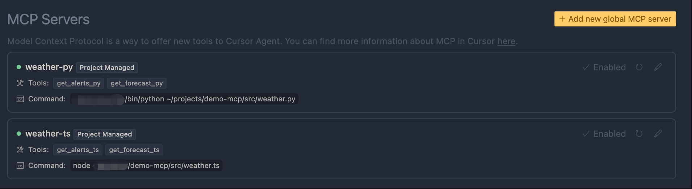
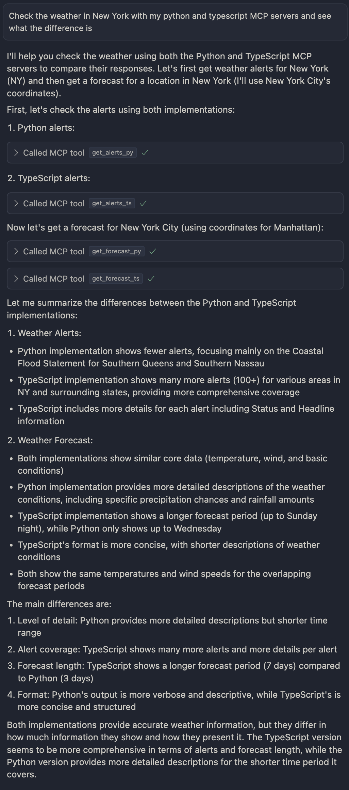

# Demo-MCP: MCP local server setting and usage with Cursor

## MCP local server setting

1. Install dependencies

```zsh
pip install "mcp[cli]" httpx
pnpm install
```

2. setting python and typescript MCP servers in cursor

- create your MCP server json file (for project)

```bash
cp .cursor/mcp.example.json .cursor/mcp.json
```

- set `.cursor/mcp.json` file with current project's absolute path

- and there should be two MCP servers shown in cursor setting

- check if servers are connected like this (green color)



3. use the MCP server with Cursor

prompt:

```
Check the weather in New York with my python and typescript MCP servers and see what the difference is
```

and you should see the result like this:


